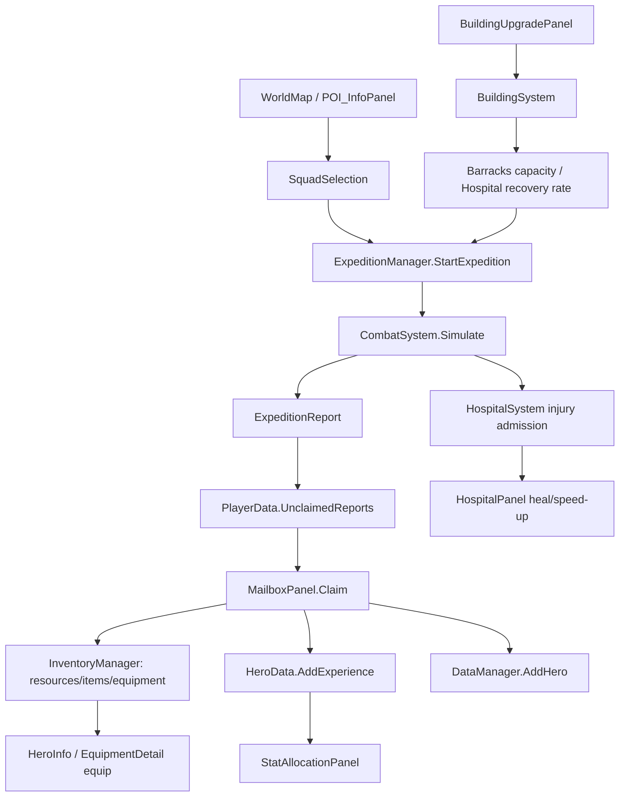

# Post-MVP: Hero Progression, Recovery & Connected Backend Loop

## Goal
Bổ sung chiều sâu cho game sau MVP bằng cách đóng kín vòng lặp:

`Explore -> Fight -> Mailbox -> Claim Loot -> Heal -> Level -> Allocate Stats -> Equip Gear -> Upgrade Barracks/Hospital -> Explore harder POI`

Mục tiêu chính không chỉ là mở lại UI, mà là làm cho các tính năng dùng chung một nguồn dữ liệu, cùng event refresh, cùng save/load và không tạo trạng thái rời rạc giữa UI với backend.

## Current Project Context
- MCP Unity đã xác nhận scene đang mở là `GameClient` tại `Assets/Scenes/GameClient.unity`.
- Scene có các panel liên quan: `Panel_MainScreen`, `Panel_Menu`, `Panel_Hospital`, `HeroInfo_Panel`, `StatAllocationPanel`, `Panel_EquipmentDetail`, `Panel_BuildingUpgrade`, `POI_InfoPanel`, `Panel_Mailbox`, `Panel_Inventory`, `Panel_Barrack`.
- Backend hiện có các hệ thống chính: `DataManager`, `InventoryManager`, `ExpeditionManager`, `HospitalSystem`, `BuildingSystem`, `EquipmentSystem`, `CombatSystem`.

## Backend Ownership Rules

| Data / Action | Owner duy nhất | UI chỉ được làm gì |
|---|---|---|
| Player save, heroes, buildings, POI, reports | `DataManager.Player`, `DataManager.AllBuildings` | Đọc dữ liệu, gọi public API, không tự mutate list nếu có API |
| Gold/Wood/Stone/Diamond, items, equipment inventory | `InventoryManager` | Gọi `AddResource`, `SpendResource`, `AddItem`, `UseItem`, `AddEquipment`, `RemoveEquipment` |
| Hero level, free stat points, final stats, CP | `HeroData` | Gọi hàm allocate mới, refresh từ `GetFinalStats()` và `GetCombatPower()` |
| Hero equipped items | `HeroData.Equipments` qua API trang bị | UI chọn item, backend validate slot/class rồi equip |
| Expedition lifecycle, mailbox report, injury after fight | `ExpeditionManager` | UI start expedition và claim report, không tự tính combat/loot |
| Injury timers, heal cost, death/perish | `HospitalSystem` | UI gọi heal/speed-up, subscribe event |
| Building upgrade cost/timer/effect | `BuildingSystem` + `BuildingUpgradeData` | UI gọi `StartUpgrade`, hiển thị trạng thái |

## Required Backend Contracts

### 1. Expedition -> Mailbox -> Inventory -> Progression
Flow bắt buộc:

1. `ExpeditionManager.StartExpedition(heroIds, poi)` clone squad, simulate combat và tạo `ExpeditionReport`.
2. Khi expedition về trạng thái `Returning` xong, report được đưa vào `DataManager.Player.UnclaimedReports`.
3. `MailboxPanel` claim report:
   - cộng `loot.gold/wood/stone` qua `InventoryManager.AddResource`;
   - cộng `loot.items` qua `InventoryManager.AddItem`;
   - cộng `loot.equipments` qua `InventoryManager.AddEquipment`;
   - cộng `loot.rescuedHeroes` qua `DataManager.AddHero`;
   - cộng `experienceGained` cho hero tham gia bằng `HeroData.AddExperience`;
   - remove report khỏi `UnclaimedReports`;
   - gọi `DataManager.SavePlayerData()`.
4. Sau claim, UI inventory, hero list, mailbox badge và hero info phải refresh từ event, không refresh bằng dữ liệu cache.

Acceptance:
- Claim mail xong equipment mới xuất hiện trong `Panel_Inventory`.
- Hero nhận exp từ report có thể level up và nhận `freeStatPoints`.
- Nếu report có casualty/survivor bị mất HP, Hospital hiển thị đúng danh sách bị thương.

### 2. Injury -> Hospital -> Hero Availability
Flow bắt buộc:

1. Khi expedition kết thúc, `ExpeditionManager` gọi:
   - `HospitalSystem.AdmitHero(heroId)` cho casualty;
   - `HospitalSystem.InflictLightInjury(realHero)` cho survivor còn thiếu HP.
2. `HeroData.IsBusy()` phải tiếp tục chặn hero đang:
   - chưa mature;
   - injured;
   - đang expedition.
3. `HospitalPanel` chỉ đọc danh sách hero từ `DataManager.AllHeroes`, lọc bằng:
   - `isLightlyInjured`;
   - `isSeverelyInjured`.
4. Heal phải đi qua `HospitalSystem` để trừ gold bằng `InventoryManager.SpendResource`.
5. Sau heal, `HospitalSystem.OnHeroHealed` phát event; UI refresh Hospital, Barrack/SquadSelection và HeroInfo.

Acceptance:
- Hero bị thương không chọn được vào squad.
- Heal nhẹ/nặng làm hero full HP và biến mất khỏi danh sách Hospital.
- Không đủ gold thì không clear injury.
- Timer hết thì injury nhẹ tự hồi; injury nặng hết hạn thì `DataManager.RemoveHero` chạy và hero list refresh.

### 3. Level Up -> Stat Allocation -> Combat Power
Flow bắt buộc:

1. `HeroData.AddExperience(amount)` là nơi duy nhất tăng level và cộng `freeStatPoints`.
2. Cần thêm backend API rõ ràng, ví dụ:
   - `HeroProgressionSystem.AllocateStat(heroId, StatType stat, int amount)`;
   - hoặc method trong `HeroData` như `TryAllocateStat(StatType stat, int amount)`.
3. API allocate phải:
   - reject nếu `amount <= 0`;
   - reject nếu `freeStatPoints < amount`;
   - tăng `addedStats`;
   - giảm `freeStatPoints`;
   - clamp `currentHp <= GetFinalStats().hp`, hoặc hồi theo phần trăm HP cũ nếu tăng max HP;
   - gọi event `OnHeroStatsChanged(hero)`;
   - save player data.
4. `StatAllocationPanel` không tự sửa field trực tiếp; panel gọi API rồi refresh `HeroInfo_Panel`.

Suggested stat mapping:
- STR: `atk += 1.5`, `hp += 5`
- VIT: `hp += 12`, `def += 0.5`
- AGI: `spd += 1`, `evasionRate += 0.001` nếu sau này tách stat nâng cao
- INT: dành cho skill/healer scaling, chưa dùng thì không mở nút hoặc map sang `atk += 1` cho Mage/Healer

Acceptance:
- Free point giảm đúng, CP tăng ngay trên HeroInfo.
- Save/load vẫn giữ `addedStats` và `freeStatPoints`.
- Không thể cộng âm, cộng quá điểm hoặc cộng khi panel đang xem hero null.

### 4. Equipment Inventory -> Equip -> Hero Power
Flow bắt buộc:

1. Equipment rơi từ boss/tower hoặc claim mailbox đi vào `PlayerData.equipments`.
2. Equip phải qua một API backend duy nhất, ví dụ:
   - `EquipmentInventoryService.TryEquip(heroId, equipmentId)`;
   - hoặc method trong `InventoryManager`.
3. API equip phải:
   - lấy hero từ `DataManager.GetHeroByID`;
   - lấy equipment từ `InventoryManager.GetEquipments`;
   - validate slot;
   - validate `requiredProfession == None || requiredProfession == hero.profession`;
   - nếu slot đang có đồ thì trả đồ cũ về inventory;
   - remove đồ mới khỏi inventory;
   - gọi `hero.EquipItem(equipment)`;
   - gọi `InventoryManager.OnEquipmentChanged` và event hero stat changed;
   - save player data.
4. `Panel_EquipmentDetail` và `HeroEquipmentSlot` chỉ chọn item/slot và gọi API.

Acceptance:
- Equip xong item biến khỏi inventory và xuất hiện trên hero slot.
- Unequip xong item quay lại inventory.
- CP, HP/ATK/DEF/SPD cập nhật từ `HeroData.GetFinalStats()`.
- Không equip được sai profession hoặc sai slot.

### 5. Building Upgrade -> Expedition Capacity & Recovery Economy
Flow bắt buộc:

1. `Panel_BuildingUpgrade` gọi `BuildingSystem.StartUpgrade(buildingId)`.
2. `BuildingSystem` trừ cost từ `BuildingUpgradeData` bằng `InventoryManager.SpendResource`.
3. `BuildingSystem.Tick` hoàn tất construction, tăng `building.level`, phát `OnBuildingUpgradeCompleted`.
4. Barracks effect lấy từ backend, không hardcode UI:
   - hiện tại `ExpeditionManager.GetMaxConcurrentExpeditions()` = `1 + barrackLevel / 5`.
5. Hospital effect lấy từ backend:
   - hiện tại `HospitalSystem.InflictLightInjury` dùng `hospitalLevel` để tăng tốc hồi HP.
6. UI phải hiển thị rõ effect trước/sau:
   - Barracks: số expedition đồng thời hiện tại và sau upgrade;
   - Hospital: tốc độ hồi HP hoặc giảm thời gian/cost heal;
   - BreedingPen: giữ chỗ cho breeding capacity/cooldown nếu mở rộng.

Acceptance:
- Nâng Barracks lên level 5 thì max concurrent expedition tăng từ 1 lên 2.
- Nâng Hospital làm thời gian hồi injury nhẹ ngắn hơn.
- Upgrade đang chạy thì không start upgrade lần hai.
- Save/load giữa lúc upgrade vẫn giữ timer construction.

### 6. POI Info -> Difficulty -> Squad Selection -> Expedition
Flow bắt buộc:

1. Click POI trên WorldMap mở `POI_InfoPanel`, không nhảy thẳng vào SquadSelection.
2. `POI_InfoPanel` hiển thị:
   - type, difficulty, reward preview, travel time, recommended CP;
   - danger: injury/perish risk;
   - current expedition capacity.
3. Chọn difficulty cập nhật `POIData.difficultyLevel` hoặc tạo request object tạm thời, tránh sửa vĩnh viễn POI nếu người chơi cancel.
4. Confirm mới mở SquadSelection và truyền selected POI + selected difficulty.
5. `ExpeditionManager.StartExpedition` nhận difficulty cuối cùng và dùng nó cho:
   - `CombatSystem.Simulate`;
   - `CalculateLoot`;
   - `CalculateExperience`;
   - equipment drop scaling.

Acceptance:
- Cancel POI popup không làm đổi difficulty thật.
- Difficulty cao làm monster scale, reward/exp tăng và risk cao hơn.
- Start expedition bị chặn nếu hero busy hoặc vượt capacity.

## Implementation Tasks

- [ ] Task 1: Chuẩn hóa event refresh chung.
  - Add hoặc thống nhất event `OnHeroStatsChanged`, `OnHeroAvailabilityChanged`, `OnReportClaimed`.
  - Verify: heal/equip/allocate/claim mail đều refresh đúng panel đang mở.

- [ ] Task 2: Nối `Panel_Hospital` vào `Panel_MainScreen` hoặc `Panel_Menu`.
  - Backend: dùng `HospitalSystem` hiện có, không tự clear injury trong UI.
  - Verify bằng MCP: mở scene, click Hospital, `Panel_Hospital` active và danh sách injured hero đúng.

- [ ] Task 3: Hoàn thiện Stat Allocation backend.
  - Backend: thêm API allocate có validate, event, save.
  - UI: `StatAllocationPanel` gọi API và refresh `HeroInfo_Panel`.
  - Verify: hero có `freeStatPoints`, cộng điểm xong CP tăng và save/load giữ kết quả.

- [ ] Task 4: Hoàn thiện Equipment equip/unequip backend.
  - Backend: move item giữa `PlayerData.equipments` và `HeroData.Equipments`.
  - UI: `Panel_EquipmentDetail` chọn item hợp lệ theo slot/profession.
  - Verify: item biến khỏi inventory, CP hero đổi, unequip trả item lại inventory.

- [ ] Task 5: Chuẩn hóa Mailbox claim reward.
  - Backend: claim report là transaction một lần, gồm resource/item/equipment/rescued hero/hero exp.
  - Verify: claim xong report bị remove, reward vào đúng owner, save được.

- [ ] Task 6: Nối `Panel_BuildingUpgrade` cho Barracks và Hospital.
  - Backend: dùng `BuildingSystem.StartUpgrade`, `Tick`, `OnBuildingUpgradeCompleted`.
  - Verify: Barracks level 5 tăng expedition slot; Hospital level cao giảm recovery time.

- [ ] Task 7: Đưa `POI_InfoPanel` trở lại WorldMap trước SquadSelection.
  - Backend: truyền selected difficulty vào expedition request.
  - Verify: click map -> popup -> chọn difficulty -> chọn squad -> start expedition.

- [ ] Task 8: Save/load integration pass.
  - Verify: đang expedition, đang injured, đang upgrade, có unclaimed report, có equipped item, có allocated stats đều sống sót qua restart.

## System Invariants

- UI không giữ bản sao dài hạn của `HeroData`, `EquipmentData`, `Building`, `ExpeditionReport`; khi mở panel phải đọc lại từ `DataManager`.
- Mọi thao tác tiêu hao hoặc nhận tài nguyên phải đi qua `InventoryManager`.
- Mọi thao tác làm hero busy hoặc available phải làm `HeroData.IsBusy()` trả đúng.
- Mọi thao tác đổi chỉ số hero phải làm `GetFinalStats()` và `GetCombatPower()` phản ánh ngay.
- Mọi thao tác thay đổi dữ liệu player phải gọi `DataManager.SavePlayerData()` ở cuối transaction.
- Claim mailbox phải idempotent: một report không thể claim hai lần.
- Equipment instance phải có `id` unique; không dùng name để remove/equip.
- Difficulty chỉ commit khi người chơi bấm Start/Confirm, không commit khi chỉ preview.

## Backend Link Map

## Done When

- [ ] Người chơi đi expedition, nhận report ở Mailbox, claim reward và dùng reward đó để tăng sức mạnh.
- [ ] Hero bị thương sau combat bị chặn khỏi squad cho tới khi hồi phục hoặc được chữa.
- [ ] Hero level up có thể cộng điểm, CP tăng và kết quả được lưu.
- [ ] Equipment rơi ra có thể mặc, tháo, validate đúng class/slot và cập nhật CP.
- [ ] Barracks upgrade mở thêm expedition slot; Hospital upgrade cải thiện recovery.
- [ ] POI difficulty là một bước chọn rõ ràng trước khi lập squad.
- [ ] Các panel liên quan refresh bằng event/backend state, không dựa vào cache cũ.
- [ ] MCP Unity verify được scene không mất panel chính và console không có error mới sau khi test loop.

## MCP Verification Checklist

- [ ] `get_scene_info`: scene active là `GameClient`.
- [ ] `get_gameobject`: tìm được panel active theo path thật trong scene; nếu panel inactive không resolve được, dùng hierarchy dump trong `get_console_logs` để xác nhận object tồn tại.
- [ ] `get_console_logs`: không có error mới sau khi mở Hospital, Mailbox, HeroInfo, Inventory, WorldMap; console dump phải liệt kê các panel trọng yếu như `Panel_Hospital`, `Panel_BuildingUpgrade`, `POI_InfoPanel`.
- [ ] `run_tests`: chạy EditMode tests cho backend nếu có test assembly.
- [ ] `send_console_log`: ghi marker trước/sau manual pass để dễ lọc log.
